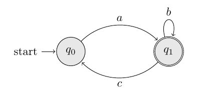
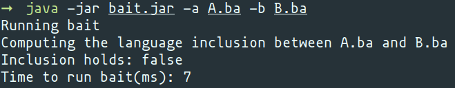

# bait - Büchi Automata Inclusion Tester


A ω-regular language inclusion checker.

- [bait - Büchi Automata Inclusion Tester](#bait---büchi-automata-inclusion-tester)
  - [Introduction](#introduction)
  - [Prerequisites](#prerequisites)
  - [Building and Running](#building-and-running)
  - [The `.ba` format](#the-ba-format)
  - [Working example](#working-example)
  - [Benchmarks](#benchmarks)
  - [Authors](#authors)

## Introduction

`bait` is an ω-regular language inclusion checker which relies on an algorithm
derived from Abstract Interpretation techniques.
The tool accepts as input two
[ω-regular languages](https://en.wikipedia.org/wiki/Omega-regular_language) represented as
[Büchi automata](https://en.wikipedia.org/wiki/B%C3%BCchi_automaton) and outputs
whether the inclusion holds or not.
The automata are represented with the [the `.ba` format](#the-ba-format).

## Prerequisites

- Java 8+

## Building and Running

Use `./gradlew build` to build `bait`.

The easiest way to run `bait` is to execute the `bait.jar` file with `java -jar bait.jar`.
You can download it from the [release page](https://github.com/parof/bait/releases).
Alternatively, you can build the `jar` file with:

```{bash}
git clone https://github.com/parof/bait
cd bait
./gradlew installDist
```

This command will build the executable `.jar` file in `build/libs`.
You can also run `bait` using `gradlew run`:

```{bash}
./gradlew run --args='-a /path/to/A.ba -b /path/to/B.ba'
```

Run with argument `--help` to see the all the available options.

## The `.ba` format

The input automata must be specified in the `.ba` format.
Other tools, for example [RABIT](http://languageinclusion.org/doku.php?id=tools#rabit_and_reduce_v25),
accept the same input format.
One `.ba` file must respect the following specification:

```{}
(initial state)
...
(transitions)
...
(accepting states)
```

Observe that automata in `.ba` format have _only one_ initial state.
One state is simply a sequence of characters. Here there are some examples:

```{}
state
state1
a
iB
[0][1][2]
```

Observe that `[0][1][2]` is a single state: the squared brackets are just part
of the name of the state and they don't have a semantic meaning.
Additionally, we require that the states don't include in the names the
strings `,` or `->`, because they will be used to define the transitions.

One transition is defined as

```{}
symbol,firstState->secondState
```

where `symbol` is a sequence of characters, and `firstState` and `secondState` are states.
Similarly to the states, the symbols can't contain `->` or `,` as substrings.
Here there are some examples of valid transitions:

```{}
a,s1->s2
1,s->s'
sym,[0][0]->[0][1]
```

If no initial state is specified, the first state in the first transition of the
automaton is considered to be the initial one.
If no final state is specified, then each state in the automaton is considered to be final.

Consider the following automaton:



It can be represented in the `.ba` format as:

```{}
q0
a,q0->q1
b,q1->q1
c,q1->q0
q1
```

Observe that since the initial state is also the first state of the first transition,
and then we can omit to specify it:

```{}
a,q0->q1
b,q1->q1
c,q1->q0
q1
```

## Working example

We want to compute whether the inclusion holds between the following automata:


The [first automaton A](./test-automata/thesisA.ba) is represented in the `.ba` format as:

```{}
a,q0->q0
b,q0->q0
a,q0->q1
a,q1->q1
q1
```

While the [second automaton B](./test-automata/thesisB.ba) is represented in the `.ba` format as:

```{}
a,q0->q1
b,q1->q0
q1
```

You can finally compute whether the inclusion holds or not using `bait.jar`
with the following command:

```{bash}
java -jar bait.jar -a A.ba -b B.ba
```

This command will give you the following output:



Since the language of A is `(a+b)*aω` and the language of B is `(ab)ω` the
inclusion doesn't hold, and then `False` is correctly returned.

## Benchmarks

In the `test-automata` directory there are some examples of automata in the
`.ba` format.
We benchmarked `bait` with a large set of automata, and they can be found in a
separate repository:
[https://github.com/parof/buchi-automata-benchmark](https://github.com/parof/buchi-automata-benchmark).

## Authors

- Kyveli Doveri
- [Pierre Ganty](https://software.imdea.org/~pierreganty/)
- [Francesco Parolini](https://parof.github.io/)
- [Francesco Ranzato](https://github.com/francescoranzato)
